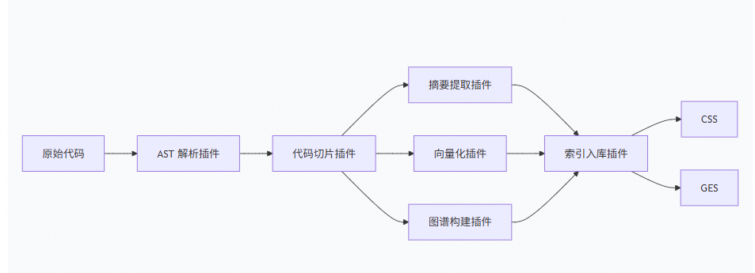

# 上下文理解（CodeBase和RAG）

在opencode中，主要通过**init初始化**、**内置检索工具**、**深度代码理解**等能力来实现代码及上下文理解

## 本地代码搜索与理解

### 项目初始化理解（init）

执行/init命令,基于grep获取代码仓的核心文件，分析当前代码库并生成一份 AGENTS.md 文件

### 内置检索tools(src/tool/*)

glob、grep、read、codesearch

### 增强型工具 [Graphify](https://github.com/safishamsi/graphify/blob/v7/docs/translations/README.zh-CN.md)

Graphify是三方插件，安装后输入 '/graphify' . 即可生成对应代码图谱

1. 基础层：AST 提取提供确定性的结构信息（tree-sitter）
2. 增强层：LLM 语义提取增加深度理解：采用SKILL从代码注释和命名推断隐式关系，并生成图关系
3. 分析层：通过 Leiden 进行社区分析，计算内聚度。通过图分析生成god nodes、惊喜评分
4. 输出层：生成报告

## 深度代码理解

通过图谱化，进行深度代码理解

### 云端代码索引架构设计

在插件中可以授权云端获取自己的代码仓，生成云端索引，云端索引基于个人改动分支增量索引与更新



| 插件名称     | 输入          | 输出         | 示例                                 |
|----------|-------------|------------|------------------------------------|
| AST 解析插件 | 源代码文件       | AST 语法树    | 将 def add(a,b): return a+b 解析成函数节点 |
| 代码切片插件   | AST         | 独立代码片段     | 提取单个函数、类、方法作为独立单元                  |
| 摘要提取插件   | 代码切片        | 补充自然语言描述   | "这是一个加法函数"                         |
| 向量化插件    | 代码切片 + 摘要   | 向量（浮点数数组）  | [0.123, -0.456, 0.789, ...]        |
| 图谱构建插件   | 代码切片 + 调用关系 | 图节点 + 边    | Function A -> calls -> Function B  |
| 索引入库插件   | 向量 + 图数据    | 写入 CSS/GES | 批量写入数据库                            |

* AST (抽象语法树)：理解单个文件内的代码结构。
* CPG (代码属性图)：融合多种图结构，进行更深层的代码分析。
* CSS Code Semantic Search（代码语义搜索库） 存储代码的向量表示，支持语义搜索
* GES Graph Engine Service（图引擎服务） 存储代码的调用关系图，支持依赖分析

### 开源工具

[ContextPlus](https://github.com/ForLoopCodes/contextplus)：将代码库转化为可搜索、层次化的“功能图谱”，以帮助 AI 理解代码

[Joern MCP](https://github.com/Lekssays/codebadger)：fastmcp+Joern 做代码审查和漏洞分析

### LSP插件

可通过语言服务协议获取符号与引用信息，提升代码仓理解与定位能力(代码导航、代码补全、代码重构和格式化、语义理解和诊断)

相比于ContextPlus的代码理解的功能增强，LSP更专注于类IDE的代码补全和提示，结合大模型提供代码续写等能力

常见语言服务器：

| 语言      | 推荐的语言服务器                     | 启动命令                                 |
|:--------|:-----------------------------|:-------------------------------------|
| Python  | `pyright`                    | `pyright-langserver --stdio`         |
| TS/JS   | `typescript-language-server` | `typescript-language-server --stdio` |
| Java    | `jdtls` (Eclipse)            | `java -jar jdtls.jar`                |
| Go      | `gopls`                      | `gopls serve`                        |
| Rust    | `rust-analyzer`              | `rust-analyzer`                      |
| C / C++ | `clangd`                     | `clangd`                             |

常见LSP客户端客户端：

* Python: pygls（实现 LSP 服务器）、python-lsp-jsonrpc（客户端）
* Node.js: vscode-languageserver-node（官方库）

## RAG Service

检索增强生成（RAG）系统，负责信息检索的两个关键阶段：初筛和精排。

核心接口：/embedding、/rerank

/embedding 这个接口用于生成文档的向量（建库时）和查询的向量（检索时），然后通过向量相似度搜索来实现文档召回。

### 一个典型的RAG请求流程

1. 初始化，调用 /embedding 接口，将文本数据向量化，并保存至向量数据库（vector_db）

2. 用户问：“公司的年假制度是什么？”

3. 调用 /embedding 接口，将这个问题转化为向量。用这个向量去向量数据库（vector_db）检索，快速找回N个可能相关的文档块。

4. 调用 /rerank 接口，传入用户问题“公司的年假制度是什么？”和第3步找回的文档块。/rerank 接口返回一个精排后的结果，其中前3个文档非常精准地解释了年假制度。

5. 你将这3个文档作为上下文，连同用户问题一起发送给大语言模型（如GPT-4）。大语言模型根据这些高质量的上下文，生成最终精准、可靠的答案。

### embedding（嵌入）的过程

embedding就是把离散的文本（词、句子）嵌入到一个连续的向量空间中，每个点代表一个词/句，意思越近的词，在空间里离得越近

使用pytorch生成张量（Tensor）数据结构，进行神经网络构建（torch.nn）与调用

1. 输入: "今天天气真好"
2. 分词（tokenizer）："今天天气真好" → ["今天", "天气", "真好"]，
   每个token对应一个数字ID: ["今天", "天气", "真好"] → [1234, 5678, 9012]
3. 添加特殊标记并填充: [CLS] + [1234, 5678, 9012] + [SEP] + [PAD]...
4. 转成张量并送入模型
   torch.tensor([101, 1234, 5678, 9012, 102, 0, 0, ...])
   调用 nn.Module，将张量token向量化
5. 模型输出：模型输出也是一个张量，比如形状 (1, 128, 768)
    * 1：1 条文本
    * 128：序列长度（128 个 token 位置）
    * 768：每个位置的隐藏状态（768 维向量）
6. 提取出最终向量: 模型输出的是每个 token 位置都有一个 768 维向量。我们需要把整个句子的信息浓缩成一个向量。
7. 输出：[0.12, -0.34, 0.56, 0.78, -0.91, ...]  # 一共768个小数

```text
输入文本: "猫坐在垫子上"

分词后:   ["猫", "坐", "在", "垫子", "上"]

模型编码后:

猫    → [0.2, 0.5, -0.1, 0.8, ...]
坐    → [0.3, 0.4, -0.2, 0.7, ...]
在    → [0.1, 0.6, -0.3, 0.9, ...]
垫子  → [0.4, 0.3, -0.4, 0.6, ...]
上    → [0.2, 0.5, -0.2, 0.8, ...]

池化后（取平均）:

"猫坐在垫子上" → [0.24, 0.46, -0.24, 0.76, ...]
                 ↑ 一个768维的向量，代表整个句子
```

# AI调用过程的可观测性

为做到可观测性，需要对AI调用的生命周期做数据埋点，埋点协议：OpenTelemetry（OTel）

  ```text
  Session ID (会话层 - 顶层)
  │  说明：代表用户的一次完整会话 
  │
  ├── Trace ID 01 (链路轨迹层1：一次完整的问答交互)
  │   │  说明：代表用户发出的第1条消息及其完整的后台处理流程
  │   │
  │   ├── Attribute: Turn Count = 1 
  │   │
  │   └── Span ID (执行单元层 - 具体的段落)
  │       │  说明：代表代码执行的具体步骤
  │       │
  │       ├── Span: 例如检索知识库 (RAG)
  │       └── Span: 例如调用 LLM 模型 (核心生成)
  │           │
  │           ├── Events: 关联到Prompt ID ## turncount  形如（注意：79082802-9287-4890-a8b2-2ac36198852b#Explore-r6jjfn#1，表示该次对话的第1轮
  │           └── Attributes: Token Stream (生成的每一个字)
  │
  └── Trace ID 02 (链路轨迹层1：一次完整的问答交互)
      │
      ├── Attribute: Turn Count = 2
      └── ...
      
  埋点层级说明
  Trace  —— 一次端到端的Agent事件【不是一个埋点实体，是一个ID】
      Span —— 一次事件周期的Agent行为，比如CodeBase调用阶段【埋点实体，JSON体】
          Event —— 事件（Event，如tool_error） 【埋点实体，JSON体】
              Attributes —— 事件属性（Attributes，对应JSON Schema中的说明，如event.name）【埋点实体，JSON属性】
      
  ```

## OpenTelemetry核心概念

### 链路

#### Session ID (会话 ID)

定位：用户上下文的容器，包括多次会话

* 定义：标识用户与LLM进行的一段连续交互的唯一标识符。
* LLM 场景意义：
    * 将原本无状态的独立请求串联起来，还原完整的对话上下文。
    * 用于分析用户留存、会话时长等业务指标。
* OTEL 标准：通常作为 Resource Attribute 或 Log Field (session.id)。

#### Trace ID (链路 ID)

定位：单次事务的骨架,用户提出的一次对话。在分布式系统中，包含一次请求在跨进程、跨服务、跨线程的完整执行路径记录。

* 定义：标识分布式系统中的一次完整请求/事务（遵循 W3C Trace Context 标准）。
* LLM 场景意义：
    * 代表用户发出的“一句话”及其引发的所有后台动作（API调用 -> 向量检索 -> 模型推理 -> 结果返回）。
    * 是进行性能分析和错误排查的核心索引。
* OTEL 标准：核心追踪字段 trace_id。

#### Span ID (跨度 ID)

定位：最小执行单元 (Atomic Operation)。Span 通过 Parent Span ID 形成调用链结构。

* 定义：标识 Trace 中的一个具体操作步骤。
* LLM 场景意义：
    * 代表具体的LLM调用，如 POST /v1/chat/completions 或 SELECT vector_db。
    * LLM Span：特指调用大模型的那次操作，挂载了 Token 消耗、延迟、模型名称等关键指标。
* OTEL 标准：核心追踪字段 span_id。

#### Event (Span Event)

* 定义：“Span 内部的高光时刻”！Span 内部的时间点记录，包含时间戳、名称和属性。
* 用途：
    * 异常捕获：记录 exception 事件及堆栈信息。
    * 流式输出：记录 Stream 模式下的 token 到达事件。
    * 推理步骤：在 ReAct/Agent 模式下，记录中间的思考（Thought）、动作（Action）和观察（Observation），避免创建过多微小 Span。

#### Turn Count (对话轮次)

* 定义：“会话深度的标尺”。量化当前请求在整个 Session 中的位置（第几轮对话）。
* 用途：
    * 上下文丢失分析：分析随着轮次增加，模型准确率的变化。
    * 成本控制：轮次越后，Context Window 越大，Token 成本越高。
* 位置：通常作为 Attribute (ai.conversation.turn_number) 打在 Trace 的 Root Span 上。

#### Prompt ID (提示词 ID)

定位：资产与版本标识 (Asset & Version Identity)

* 定义：标识所使用的 Prompt 模板版本或特定 ID。通常作为 Attribute 挂载在执行 LLM 调用的 Span 上。
* LLM 场景意义：
    * 属于领域特定（Domain Specific）概念，而非 OTEL 原生字段。用于区分“用的是哪套逻辑/指令”。
    * 支持 A/B 测试分析（例如：对比 v1.0 和 v2.0 模板的幻觉率）。
* 位置：通常作为 Attribute 挂载在执行 LLM 调用的 Span 上。

### 日志

* LogRecord：日志记录，包含时间戳、严重级别、Body（消息体）、Attributes（附加字段）。
* Log 与 Trace 的关联：通过在 LogRecord 的 Attributes 中显式写入 trace_id 和 span_id 来实现。

### Metrics

* Meter：负责创建和收集指标的组件。
* Instrument：具体的测量工具，分为不同类型：
    * Counter：只增不减的计数器（如：请求总数）。
    * UpDownCounter：可增可减的计数器（如：当前活跃连接数）。
    * Histogram：分布统计（如：请求延迟的P99）。
    * Gauge：某一时刻的快照值（如：当前CPU温度）。
* Data Point：指标的具体数值点，包含时间戳、值、Attributes。

## OpenCode 整体交互生命周期

面向“从一次用户输入到会话收尾”的完整执行路径，基于当前代码架构整理。

### 顶层生命周期树（Conversation 视角）

```text
Conversation (session_id)
├─ A. 初始化 / 连接层
│  ├─ API/SSE 建连：/event
│  │  ├─ server.connected
│  │  └─ server.heartbeat (周期)
│  ├─ 会话创建/读取
│  │  ├─ session.created
│  │  └─ session.updated
│  └─ 客户端入口（任选其一）
│     ├─ POST /session/:id/message         (同步 prompt)
│     ├─ POST /session/:id/prompt_async    (异步 prompt)
│     └─ POST /session/:id/command         (命令驱动)
│
├─ B. Turn（一次用户提交）
│  ├─ B1. 接收输入
│  │  ├─ 生成 user message + parts
│  │  ├─ 会话 touch / 权限合并
│  │  └─ 若 noReply=true：直接返回（无 assistant 执行）
│  │
│  ├─ B2. 进入运行循环 loop
│  │  ├─ session.status = busy
│  │  ├─ 装配上下文
│  │  │  ├─ 历史消息（含 compact 过滤）
│  │  │  ├─ system / instruction / agent prompt
│  │  │  ├─ model 解析与检查
│  │  │  └─ tools 解析（内置 + MCP + 插件）
│  │  └─ 创建 assistant message（本轮输出容器）
│  │
│  ├─ B3. 推理与流式输出（Processor）
│  │  ├─ start / start-step
│  │  │  ├─ step-start part（可带 snapshot）
│  │  │  └─ 后续可生成 patch part
│  │  ├─ text 流
│  │  │  ├─ text-start -> message.part.updated
│  │  │  ├─ text-delta -> message.part.delta
│  │  │  └─ text-end   -> message.part.updated
│  │  ├─ reasoning 流
│  │  │  ├─ reasoning-start -> message.part.updated
│  │  │  ├─ reasoning-delta -> message.part.delta
│  │  │  └─ reasoning-end   -> message.part.updated
│  │  ├─ tool 流
│  │  │  ├─ tool-input-start (pending)
│  │  │  ├─ tool-call        (running)
│  │  │  ├─ tool-result       -> completed
│  │  │  └─ tool-error        -> error
│  │  └─ finish-step
│  │     ├─ step-finish part（tokens/cost/reason）
│  │     ├─ assistant message 更新
│  │     └─ summary / compaction 判定
│  │
│  ├─ B4. 人机闸门（按需）
│  │  ├─ Permission
│  │  │  ├─ permission.asked
│  │  │  └─ permission.replied (once/always/reject)
│  │  └─ Question
│  │     ├─ question.asked
│  │     ├─ question.replied
│  │     └─ question.rejected
│  │
│  ├─ B5. 子任务/多代理（按需）
│  │  ├─ subtask part（携带 agent/prompt/model）
│  │  ├─ 主代理继续执行
│  │  └─ command.executed（命令触发链路）
│  │
│  ├─ B6. 异常与重试
│  │  ├─ 可重试错误
│  │  │  ├─ session.status = retry(attempt,next)
│  │  │  └─ sleep(backoff) 后继续 loop
│  │  ├─ 不可重试错误
│  │  │  ├─ session.error
│  │  │  └─ session.status = idle
│  │  └─ 中断/取消
│  │     ├─ abort
│  │     ├─ 未完成 tool part 标记 error
│  │     └─ session.status = idle
│  │
│  └─ B7. 收尾
│     ├─ 可能触发 session.compacted
│     ├─ 回传本轮 assistant message + parts
│     └─ session.status = idle
│
└─ C. Conversation 结束
   ├─ session.deleted（可选）
   └─ global.disposed（进程/实例级）
```

### 事件流视角

```text
用户输入
→ session.prompt / session.prompt_async / session.command
→ session.status: busy
→ message.updated (assistant 初始化)
→ message.part.updated / message.part.delta (text/reasoning/tool/step...)
→ permission.* / question.* (如果触发审批)
→ session.status: retry (如果触发重试)
→ session.error (如果最终失败)
→ session.compacted (如果触发压缩)
→ session.status: idle
→ 返回 assistant 最终消息
```

### 关键状态机

```text
idle
 └─(prompt/command)→ busy
busy
 ├─(retryable error)→ retry
 ├─(done)→ idle
 ├─(fatal error)→ idle
 └─(cancel/abort)→ idle
retry
 ├─(backoff 到期)→ busy
 └─(abort/fatal)→ idle
```

### opencode 埋点和触发源码分析

1. 事件发生点（代码各处 Bus.publish调用）

    * tool/write.ts:47 → Bus.publish(File.Event.Edited, {...})

    * session/tool-delta.ts:39 → Bus.publish(MessageV2.Event.PartUpdated)

    * server/routes/session.ts:853 → Bus.publish(Session.Event.Error, ...)
2. Bus.publish() 发布事件 （ bus/index.ts:83-98 ）
3. 插件订阅并响应（plugin / index.ts:267 - 276）

    ```shell
    bus.subscribeAll().pipe(
        Stream.runForEach((input) =>
            for (const hook of hooks) {
                hook["event"]?.({event: input})  ← 遍历调用每个插件的
                event
            }
        ) 
    )
    ```

4. 埋点插件被触发，按照event.type消费并处理各事件动作

  ```shell
  event: async ({ event }) => {                    
      if (event.type === "message.updated" && ...) {
        // 处理 agent_start 埋点                         
      }                                              
  }
  ```

## 列举的几个埋点时机

* custom-agent-start： Agent 启动
* custom-agent-finish： Agent 完成
* custom-llm-timing： LLM 调用耗时
* custom-llm-response： LLM 响应内容
* custom-llm-error： LLM 调用错误
* repeat-exception： LLM 重复调用异常
* custom-tool-timing： 工具执行耗时
* custom-session-error： 会话异常
* custom-session-finish： 会话结束
* custom-user-approval： 用户审批结果
* custom-rule-call： 规则调用
* custom-chat-compression：会话压缩

## opencode的一些特性

### opencode的tool工具的定义和使用

工具定义的位置：packages/opencode/src/tool，通过Tool.define定义了工具的名字和行为，其中execute方法是实际工具的执行

* id：工具名字
* init：定义的初始化方法，在register.tools中会调用init初始化工具
* execute：在AgentCommand中，会调用tool.execute做实际工具执行

# 上下文管理与 Token 控制

## Claude中的Token管理技巧

1. /clear。上下文清理，由于 Claude 会在每条新消息中重新发送整个对话历史，长对话会成倍增加输入 token 成本。

2. 使用 .claudeignore：防止 AI 读取大型文件、构建产物或依赖文件夹，这些内容会迅速占满上下文。

3. 模型选择：日常任务默认使用 Claude 3.5 Sonnet；仅将 Opus 留给高复杂度任务，以节省单位 token 成本。

4. 提示词精准：具体、简洁的提示词可减少用于澄清的来回循环。

5. /compact：定期压缩对话历史，以降低其 token 占用量。

## token用量监控

1. 监控使用量：使用 Claude 使用量与成本 API 追踪 token 消耗，识别高成本的开发者。

2. 状态栏工具：实现自定义状态栏，在终端内实时监控 token 开销。

3. 管理 Agent 倍数：注意，使用多个并行 agent 相比单 agent 会话，可能使 token 使用量增加 7 倍以上。

## checkpoint的回滚机制

### 触发回滚的时机

* 用户点击消息右下角的菜单按钮，选择 "revert" 时调用
* 快捷键 Undo (index.tsx:517-521)
* 用户按下 messages_redo 快捷键（默认为 Ctrl+Shift+R）时调用，重做到下一个用户消息

### session回退

packages/opencode/src/session/revert.ts

* revert(): session运行会保存快照，保存到 session.revert.snapshot中。触发回退会按照保存的快照回退。

* unrevert(): 恢复到保存的快照，撤销回退操作。

### 项目快照恢复（git write-tree）

packages/opencode/src/snapshot/index.ts

* 利用 Git 的 write-tree 创建快照，存储在独立的 .opencode 目录中。

* 使用 git read-tree + git checkout-index 恢复整个工作区。

* 使用 git checkout 从指定 hash 恢复单个文件。

---------- inging

# opencode（AgentKernel） 二次开发的特性需求记录

AgentKernel为CLI、AI IDE、IDE插件和云端等场景提供归一化AgentService，基于opencode框架，满足多种研发智能体场景需要

1. 由AgentKernel统一提供多场景共用的Agent/SubAgent和内置工具；
2. 灵活扩展、支持Skill、MCP接入；
3. 内置TurboContext和本地Codebase、memory等能力。

## 开发指南

| 规则	     | 说明                                                      |
|---------|---------------------------------------------------------|
| SDK生成命令 | 	更新了 JS/Python/Java SDK 的生成脚本路径                         |
| 代码隔离    | 	新功能必须开发在 packages/opencode/src/custom-hw/ 目录下          |
| 注释规范    | 	修改现有代码必须使用 // #region custom / // #endregion custom 标注 |
| 插件优先    | 	新功能优先开发为插件，只有插件不可行才修改源码                                |
| 向后兼容    | 	修改接口时必须保证向后兼容                                          |

## 具体特性规则

1. 安全：黑名单沙箱运行（子进程运行，限制只对工作目录存在读写权限，默认不开启）
2. digital-avatar 支持数字分身
3. 新增telemetry埋点插件，优化AI调用过程的可观测性


  
