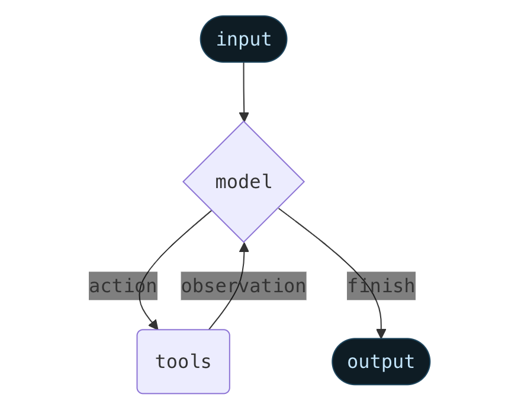

# LC的理念

## 对于LLM的一些核心观念
* LLMs是一项伟大的技术
* LLMs在和外部资源整合时，能得到1+1>2的效果
* LLMs将在未来使得应用以一种更为智能的形式呈现给用户
* 尽管构建一些简单的智能体(agentic application)很容易，但是构建足够可靠，可投入生产的智能体依然很难

## LangChain的两个核心注意点
### 我们希望帮助开发者使用最佳模型进行构建
不同的供应商提供了不同的API，具有不同的模型参数和不同的消息格式。我们的重点是标准化模型的输入输出。使开发者可以轻松的使用最新的模型。

### 我们希望简化模型和外部资源整合的复杂过程
模型不应该只作用于文本生成，最重要的是和其他数据和外部API协调。LangChain使得LLM和外部工具的对接更加容易，并帮助和解析非结构化数据。

# Agents
## 核心概念
### Agents

Agent[一直运行](https://simonwillison.net/2025/Sep/18/agents/)到直到满足条件的结果--直到最终结果输出或者达到迭代限制。

智能体是模型和工具的整合，为了解决某个一个场景的抽象

### Model
#### 静态模型
```python
from langchain.agents import 
from langchain_openai import ChatOpenAI

agent = create_agent(
    "openai:gpt-5",
    tools=tools
)

model = ChatOpenAI(
    model="gpt-5",
    temperature=0.1,
    max_tokens=1000,
    timeout=30
    # ... (other params)
)
agent = create_agent(model, tools=tools)
```
#### 动态模型
```python
from langchain_openai import ChatOpenAI
from langchain.agents import create_agent
from langchain.agents.middleware import wrap_model_call, ModelRequest, ModelResponse

basic_model = ChatOpenAI(model="gpt-4o-mini")
advanced_model = ChatOpenAI(model="gpt-4o")

@wrap_model_call
def dynamic_model_selection(request: ModelRequest, handler) -> ModelResponse:
    """Choose model based on conversation complexity."""
    message_count = len(request.state["messages"])

    if message_count > 10:
        # Use advanced model for longer conversations
        model = advanced_model
    else:
        model = basic_model

    request.model = model
    return handler(request)

agent = create_agent(
    model=basic_model,  # Default model
    tools=tools,
    middleware=[dynamic_model_selection]
)
```
### Tools
Tools赋予agent执行action的能力。通过以下方式促进工具调用：
* 顺序多个tool调用
* 并发多工具调用
* 基于条件的动态调用
* 重试和错误处理
* 跨工具的的状态持久化

#### 工具定义
```python
from langchain.tools import tool
from langchain.agents import create_agent

@tool
def search(query: str) -> str:
    """Search for information."""
    return f"Results for: {query}"

@tool
def get_weather(location: str) -> str:
    """Get weather information for a location."""
    return f"Weather in {location}: Sunny, 72°F"

agent = create_agent(model, tools=[search, get_weather])

```

#### 错误处理
```python
from langchain.agents import create_agent
from langchain.agents.middleware import wrap_tool_call
from langchain_core.messages import ToolMessage

@wrap_tool_call
def handle_tool_errors(request, handler):
    """Handle tool execution errors with custom messages."""
    try:
        return handler(request)
    except Exception as e:
        # Return a custom error message to the model
        return ToolMessage(
            content=f"Tool error: Please check your input and try again. ({str(e)})",
            tool_call_id=request.tool_call["id"]
        )

agent = create_agent(
    model="openai:gpt-4o",
    tools=[search, calculate],
    middleware=[handle_tool_errors]
)
```

### System prompt
```python
from typing import TypedDict

from langchain.agents import create_agent
from langchain.agents.middleware import dynamic_prompt, ModelRequest

class Context(TypedDict):
    user_role: str

@dynamic_prompt
def user_role_prompt(request: ModelRequest) -> str:
    """Generate system prompt based on user role."""
    user_role = request.runtime.context.get("user_role", "user")
    base_prompt = "You are a helpful assistant."

    if user_role == "expert":
        return f"{base_prompt} Provide detailed technical responses."
    elif user_role == "beginner":
        return f"{base_prompt} Explain concepts simply and avoid jargon."

    return base_prompt

agent = create_agent(
    model="openai:gpt-4o",
    tools=[web_search],
    middleware=[user_role_prompt],
    context_schema=Context
)

# The system prompt will be set dynamically based on context
result = agent.invoke(
    {"messages": [{"role": "user", "content": "Explain machine learning"}]},
    context={"user_role": "expert"}
)
```

## 高级设置
### 结构化输出
#### ToolStrategy
```python
from pydantic import BaseModel
from langchain.agents import create_agent
from langchain.agents.structured_output import ToolStrategy

class ContactInfo(BaseModel):
    name: str
    email: str
    phone: str

agent = create_agent(
    model="openai:gpt-4o-mini",
    tools=[search_tool],
    response_format=ToolStrategy(ContactInfo)
)

result = agent.invoke({
    "messages": [{"role": "user", "content": "Extract contact info from: John Doe, john@example.com, (555) 123-4567"}]
})

result["structured_response"]
# ContactInfo(name='John Doe', email='john@example.com', phone='(555) 123-4567')
```

#### ProviderStrategy
使用模型提供商提供的结构化输出
```python
from langchain.agents.structured_output import ProviderStrategy

agent = create_agent(
    model="openai:gpt-4o",
    response_format=ProviderStrategy(ContactInfo)
)
```

### Memory
对通话历史的记录

#### 基于middleware
```python
class CustomState(AgentState):
    user_preferences: dict

class CustomMiddleware(AgentMiddleware):
    state_schema = CustomState
    tools = [tool1, tool2]

    def before_model(self, state: CustomState, runtime) -> dict[str, Any] | None:
        ...

agent = create_agent(
    model,
    tools=tools,
    middleware=[CustomMiddleware()]
)

# The agent can now track additional state beyond messages
result = agent.invoke({
    "messages": [{"role": "user", "content": "I prefer technical explanations"}],
    "user_preferences": {"style": "technical", "verbosity": "detailed"},
})
```

#### 基于state_schema
```python
class CustomState(AgentState):
    user_preferences: dict

agent = create_agent(
    model,
    tools=[tool1, tool2],
    state_schema=CustomState
)
# The agent can now track additional state beyond messages
result = agent.invoke({
    "messages": [{"role": "user", "content": "I prefer technical explanations"}],
    "user_preferences": {"style": "technical", "verbosity": "detailed"},
})
```

### Streaming
```python
for chunk in agent.stream({
    "messages": [{"role": "user", "content": "Search for AI news and summarize the findings"}]
}, stream_mode="values"):
    # Each chunk contains the full state at that point
    latest_message = chunk["messages"][-1]
    if latest_message.content:
        print(f"Agent: {latest_message.content}")
    elif latest_message.tool_calls:
        print(f"Calling tools: {[tc['name'] for tc in latest_message.tool_calls]}")
```

### Middleware
中间件无缝集成到代理的执行图中，允许您在关键点拦截和修改数据流。
中间件为agent提供扩展性能力：
1. 模型调用前处理：上下文输入、消息修剪
2. 修改或验证模型的响应：内容过滤
3. 自定义处理工具逻辑
4. 根据状态或者上下文动态选择模型
5. 添加自定义日志记录、监控和分析