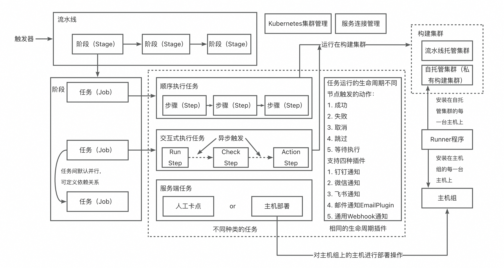
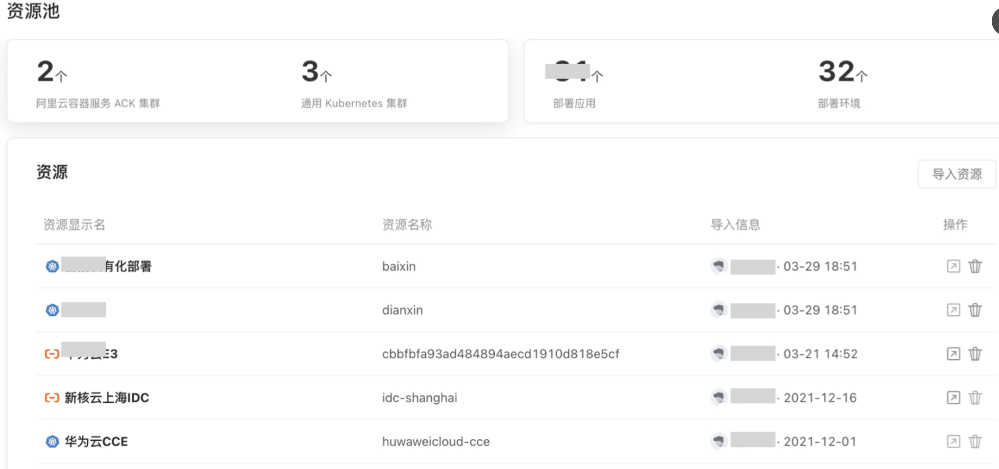

# 云效

## 技术方案
### 执行机的安装与使用
* 云内ecs可以直接选择并添加到主机组自动安装runner，无需手动安装
* 云内ecs优先会使用内网访问，但是实际构建过程可能仍需开启公网
* 一个runnner可以跑多个任务，可配置允许的最大并发任务数。
* 支持日志自动清理、构建缓存LRU、容器清理、镜像清理

### [缓存](https://help.aliyun.com/zh/yunxiao/user-guide/pipeline-cache?spm=a2c4g.11186623.help-menu-150040.d_2_5_1_4_1.2dd044e6l2fVSb&scm=20140722.H_2831720._.OR_help-T_cn~zh-V_1)

使用私有集群时，若选择让任务运行在VM中，则缓存会直接存储在构建机中。而若使用容器构建，则缓存默认依然会保存在云端。容器缓存支持配置在本地，以避免私有集群网络原因导致的构建变慢。

| 缓存类型 | 存储位置 | 共享范围 | 清理机制 | 大小限制/注意事项 |
| :--- | :--- | :--- | :--- | :--- |
| **任务级文件缓存** | 云端 OSS | 同一流水线的**同一任务**的不同执行实例之间 | 手动清除或**超过3个月未更新**自动清理 | 压缩后超过 **2GB** 不会上传 |
| **本地文件缓存** | 私有构建集群宿主机的特定目录 | 通过**目录挂载**实现**同一主机上多个任务**共享 | 提供清理工具，清理**15天未更新**的缓存目录 | 需定期清理，防止磁盘占满 |
| **镜像构建缓存 (公共集群)** | 云端（通过 BuildKit sidecar 容器） | 同一流水线的**同一任务**的不同执行实例之间 | 随缓存上下文一同上传至云端，下次构建恢复 | 缓存超过 **5GB** 不会上传 |
| **镜像构建缓存 (私有集群)** | **本地 Docker 守护进程** | 依赖于本地 Docker 缓存机制 | 本地 Docker 管理 | 无明确大小限制，但需关注本地磁盘空间 |
| **Registry 镜像缓存** | 指定的远端镜像仓库（如阿里云 ACR） | 所有能访问该镜像仓库的任务 | 手动管理或通过镜像仓库策略清理 | 无明确大小限制，但需关注镜像仓库的存储容量 |

### 安全
#### [安全白皮书](https://files.alicdn.com/tpsservice/9cf537064778daf9f67d268268aefb94.pdf?spm=a2c4g.11186623.0.0.2efe6378RPDML4&file=9cf537064778daf9f67d268268aefb94.pdf)

* 离职用户权限清理，与钉钉企业管理绑定，离职后可自动清理权限。
* 支持多级精细化权限管理；多角色权限分级
* 审计日志

#### 构建安全
* 镜像安全：防篡改(sha256完整性认证)、镜像数字签名、可信镜像仓库、镜像扫描
* 内网构建：支持使用私有构建集群
* [运行时安全：sidecar + buildkit](https://help.aliyun.com/zh/yunxiao/user-guide/pipeline-cache?spm=a2c4g.11186623.help-menu-150040.d_2_5_1_4_1.2dd044e6l2fVSb&scm=20140722.H_2831720._.OR_help-T_cn~zh-V_1)

当使用公共构建集群时：云效流水线会在构建环境中临时拉起一个 buildkitd 的 sidecar 容器，然后在镜像构建的容器中通过 http 连接到这个 buildkitd，使用 buildkit 进行镜像构建。当构建结束时，buildkitd 的 sidecar 容器会将整个 buildkit 的上下文打包上传到云端，并在下次构建时在 buildkitd 的 sidecar 容器中下载该缓存文件，恢复 buildkitd 的上下文，从而达到提供镜像缓存的能力。

同样，镜像构建缓存的生效范围也是任务级的，不同的流水线的或者同一个流水线的不同任务的缓存都是互相隔离的。

当使用私有构建集群时：镜像构建的任务会直接挂载宿主机上的 dockerd 来进行镜像构建，这时的镜像构建缓存则存在于构建机本地。

### 在线调试
当云效的流水线任务（例如构建、测试）执行失败后，系统不会立即清理和销毁执行该任务的Kubernetes Pod，而是将其暂时保留一段时间（例如1小时）。

用户可以在保留时间内，重新“连接”或“登陆”到这个被保留的容器环境中。可以像操作一台真实的服务器一样，在这个失败时的原始现场执行命令、查看日志、检查文件状态，从而精准地定位失败原因。

本地调整：在本机环境中，拉取云效流水线环境的镜像，模拟与Flow上相同的容器环境，并直接在本机中进行命令调试。

## 功能与模块
### 项目协作(专注用户体验)
* 支持自定义首页工作台，可按照不同的用户角色自己DIY自己的工作台首页(依赖ali自身的组件化能力)
* 组织管理，目前在华为云codearts上未看到基于组织的成员管理，landingzone承载了一部分功能。组织管理可以进行一些全局级别的控制。
* 完整的需求管理、版本管理、迭代管理都有较为直观的可视化图表呈现(未实际使用，不知道实际使用体验如何)
* 支持迁移动作：jira导入

### 代码管理
* 类似github，也提供了发行版本管理，可直接下载某个版本的发行产物
* 提供WebIDE在线代码编辑
* 代码评审AI助手已经上线，可自动扫描MR上的代码检视问题(效果未实际体验，暂未知)
* 使用AGit-Flow，可以在本地进行代码审查，类似gerrit

### 流水线

* 支持交互式发布，可以基于前一个阶段返回的结构，判断当前步骤如何执行
* 流水线分组支持对每个分组配置角色，流水线自动继承对应分组的权限
* 支持多维度的[统计报表](https://help.aliyun.com/zh/yunxiao/user-guide/assembly-line-statistics-report?spm=a2c4g.11186623.help-menu-150040.d_2_5_2_7.516b2a67TpetA8&scm=20140722.H_2796423._.OR_help-T_cn~zh-V_1)
* 使用go template原生语法作为流水线模板
* 公共执行机不支持推送镜像到企业版ACR
* 制品上传方式：Packages、公共存储空间、OSS

#### [变量](https://help.aliyun.com/zh/yunxiao/user-guide/environment-variables?spm=a2c4g.11186623.help-menu-150040.d_2_5_2_5.308c404e19Pauq&scm=20140722.H_153688._.OR_help-T_cn~zh-V_1#b106db50a15jy)
变量来源：内置系统变量、流水线自定义变量、通用变量组
主要使用场景：${xx}引用、流水线配置中引用、镜像构建时引用、配置文件替换

##### 公共构建环境变量的传递
* 任务内环境变量传递：echo 'USER_abc=123' > .env
* 任务间环境变量传递：需要具体的配置将变量升级为流水线级别的变量

##### VM构建环境(非容器)
* 任务内环境变量传递：echo "yaojia_Test=myParam" >> "$FLOW_ENV"
* 任务间环境变量传递：需要具体的配置将变量升级为流水线级别的变量

#### 制品仓库 应用交付
todo

### AppStack
AppStack 和流水线 Flow 都是云效产品矩阵中的子产品。流水线 Flow 只能做部署，没有应用、环境、资源池的概念，AppStack 是对流水线持续部署（CD）能力的补充。流水线只能表达任务流程，多了以后只能分组管理，分类难规范，用 AppStack 中的应用概念囊括流水线、环境、资源等等信息，可以让研发管理更规范。

可以将其他云服务的环境，抽象配置为AppStack中的资源

## 一些小特性
### 优势
* github等服务扩展点支持配置公钥认证
* 对于触发源，可以是代码源、webhook、ACR触发、定时任务、上级流水线、Jenkins.
* 选择提交代码触发会自动生成webhook，方便用户配置
* 私有构建集群的构建时长和并发任务数不计入企业构建配额
* 开发模式遵循github插件规则，语言为nodejs
* 支持移动端构建、安卓构建、微信小程序发布
* 使用maven-deploy-plugin和altDeploymentRepository，不需要在pom文件中指定坐标
* 主机部署、k8s部署、等多种形态的部署。支持对云上其他微服务的部署：函数计算FC、弹性伸缩ESS、资源编排服务ROS等。
* 全局设置支持批量修改

### 劣势
* 删除流水线没有回收站，无法恢复
* 不支持instruction as code 即无法读取代码仓中的yml文件，只能维护在线上
* [与jenkisn的一些差异](https://help.aliyun.com/zh/yunxiao/user-guide/migrating-from-jenkins-to-flow?spm=a2c4g.11186623.help-menu-150040.d_2_5_1_6.6fb2296aTofPjx&scm=20140722.H_2808185._.OR_help-T_cn~zh-V_1)

### 最佳实践

#### [cicd开发流程](https://help.aliyun.com/zh/yunxiao/user-guide/multi-environment-image-promotion-reuse-best-practices?spm=a2c4g.11186623.help-menu-150040.d_2_5_1_5_1.651816c9Ud1jh7)

开发在测试环境提交代码，并基于特性分支开发自验证。验证通过后，基于MR合入master，流水线自动触发部署预发。测试在预发做安全、性能和稳定性测试。

流水线源可以选择另一个流水线作为源（类似父子流水线），可直接引用上一个流水线最后一次构建（可选择）的产物。例如，生产发布可选用预发流水线的产物佐为流水线源发布。

#### [分支模式](https://help.aliyun.com/zh/yunxiao/user-guide/branch-mode?spm=a2c4g.11186623.help-menu-150040.d_2_5_7_0.694370fdIwyz80)

master代表最新发布版本、在feature分支上开发、release分支用于集成和发布。

每个环境都应该需要一个release分支，防止互相干扰和影响。当将集成成果从一个环境传递到下一个环境时，应基于 master 分支创建新的 release 分支，将前一个环境的 release 分支合并到新的 release 分支上。

新增一个分支管理器，分支管理器定义一个基础分支，可以增加多个运行时分支，每个分支都是特性分支。实际运行，会将所有的特性分支合并为release分支部署，自动完成公共分支代码合并。

通过分支管理器，支持在运行过程中进行代码合并，支持变量组，让不同的流水线关联一组或者多组变量

#### [SCRUM-业产技融合分层协作方案](https://help.aliyun.com/zh/yunxiao/use-cases/layered-collaboration-scheme-for-industry-industry-technology-integration?spm=a2c4g.11186623.help-menu-150040.d_3_1_9.f43a2cb7sDp7vB)

* 技术团队所做的需求，是否很好的支撑了公司的业务发展？
* 产品演进的中长期规划是什么，现在所做的需求对于产品的发展是否具有价值？

第一个问题如果回答的不好，就会出现技术团队很忙，效率也很高，但是仍然无法满足公司的业务发展，或者无法让业务团队感到满意。

第二个问题如果回答的不好，就会出现产品技术团队每天在不断的接需求、做需求，功能在不断增加和堆叠，但是产品的竞争力却没有提高，时间长了对产品的演进危害很大。

源源不断的产品需求时，SCRUM可以帮助技术团队找到一个科学的工作节奏，通过一个接一个的迭代，持续交付需求，并且可以对研发过程中的问题进行快速的改进，在下一个迭代就能马上得到验证，这样不断的探索整个技术团队的极致工作效率。

业产技分层协作模式，不仅仅关注研发交付过程，而是对业务、产品、技术三个团队的工作流程分别定义，再通过分层的方式，让三个团队的协作有机的融合在一起。在业产技的“技”这个领域，SCRUM其实是业产技方案 中的一环，是技术团队的一种选择。

我们需知道，日常项目协作中的任务状态自动流转、需求自动指派、自动催办、平台集成等事情，完全可以通过简单的自动化规则设定完成

#### 示例
云效提供了各种行业（互联网、电商、金融、制造业）的各种产品形态的最佳实践，具有很大的借鉴意义。

* [商米](https://help.aliyun.com/zh/yunxiao/product-overview/business-meters-devops-transformation-to-achieve-lean-development-and-automated-operation-and-maintenance?spm=a2c4g.11186623.help-menu-150040.d_0_0_3_1_7.60391c19Dvrp49&scm=20140722.H_250175._.OR_help-T_cn~zh-V_1)
* [新核云](https://help.aliyun.com/zh/yunxiao/product-overview/new-core-cloud-solving-multi-environment-deployment-challenges-with-cloud-efficiency?spm=a2c4g.11186623.help-menu-150040.d_0_0_3_1_0.3df34a09k26ClS&scm=20140722.H_438642._.OR_help-T_cn~zh-V_1)
* [差旅一号](https://help.aliyun.com/zh/yunxiao/product-overview/cloud-efficiency-can-be-one-stop-enterprise-consumption-management-leading-brand-travel-one-continuous-delivery-of-new-power?spm=a2c4g.11186623.help-menu-150040.d_0_0_3_2_0.25d656abHvp6X4&scm=20140722.H_341595._.OR_help-T_cn~zh-V_1)