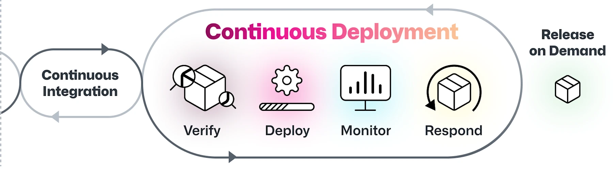
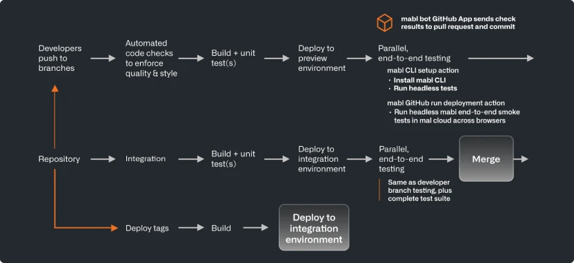

# DevOps
devops是一套软件开发方法论，为了支持对服务和应用进行高效而持续的交付。通过整合软件开发(dev)和IT操作团队(ops),在开发生命周期的每个阶段都建立高速和敏捷性，似的组织可以更加的高效。增强协作、更加高效、改进质量和安全、更快的响应市场。

## devops是如何工作的？
DevOps概念兴起于2000s，早期的devops致力于整合开发和运维团队，逐渐的包含了质量团队、安全团队和其他相关工作人员。DevSecOps是开发、运营和运维的缩写。而安全应该贯穿整个开发生命周期，而不是等到服务上线后，再通过安全团队去发现问题。

生命周期：Plan、Code、Build、Test、Release、Deploy、Operate、Monitor。

## devops应该具备三个重要原则
1. 跨团队协作：devops倡导注重团队协作与开放沟通的文化。以共同目标为导向，以集成的流程和工具帮助下，各团队发挥所长，对变更和问题进行快速响应和解决。
2. 自动化：简化重复动作，包括测试、部署、监控、安全等。团队可以更加精确和高效的解决问题，可以更加专注于需求本身。
3. cicd：devops的成功实践离不开cicd。

## AI在devops上的作用
* 使用AI生成代码或者开发建议
* 开发人员使用AI自动执行代码测试
* 运维团队使用AI实时监控，在发现异常时触发告警
* 安全团队使用AI总结软件和系统漏洞并提供解决建议

## devops面临的挑战
* 基础设施升级：个人认为，真正的devops一定要建立在k8s之上，让程序员从环境和运维中释放出来
* 掌握基础设置即代码(laC)的前期成本很高，对开发、运维人员的要求更高
* 微服务治理：通过云原生技术将应用拆分为独立的小型服务。管理数十甚至数百个服务需要成熟的流水线、健全的监控体系和无缝协作机制。
* 以为人本的文化建设：过度依赖工具的使用，反而会导致僵化和效率低下。工具需要迭代，而更需要的是进行devops文化建设。
* 安全实践：平衡团队效率和安全检测和安全测试。在保证交付速度的同时确保安全性。

## 最佳实践
### CICD
频繁将代码合并至共享仓库，通过自动化构建和测试及早发现问题。自动将变更推进至预发布或生产环境，实现更快速平滑的交付。

成功案例：某跨国电商企业每次提交代码都触发自动化测试，即使日均代码变更数百次，仍能保持高质量代码库。

成功案例：某软件公司通过CD向部分用户测试新功能后再全量发布，大幅降低大规模故障风险。

### 自动化、态势感知、持续监控
通过自动化实现测试、安全扫描、部署和监控的流程优化，提升效率并减少失误。实时掌握DevOps流水线运行状态并预测趋势，主动识别和解决问题。在整个生命周期持续监控软件和基础设施，及时发现问题并收集性能数据。

成功案例：某大型银行集团实现包含安全检查的端到端构建-测试-部署自动化，代码变更审批时间从数周缩短至小时级，同时提升合规性。

成功案例：某医疗机构在新功能发布时，通过集中式日志和实时告警系统监测用户行为与错误率，必要时快速回滚。

成功案例：某大型零售连锁上线新服务时，同步监控服务器可用率等IT指标与点击率等业务指标，综合评估技术表现与商业价值。

### 基础设施即代码（IaC）
通过可复用的代码自动化配置本地或云基础设施，支持团队规模化高效协作。

成功案例：某酒店集团使用IaC快速创建开发、测试和生产环境的完全一致副本，确保部署流程的标准化。

### 微服务架构
采用微服务支持云原生服务的高效开发、部署和扩展。

成功案例：某网约车企业DevOps团队独立开发司机匹配、行程跟踪等微服务，各服务可独立演进互不影响。

## 实施DevOps的避坑指南：
* 勿在修复流程前盲目自动化——只会放大混乱
* 勿忽视协作——DevOps的核心是人的协同
* 勿强推统一工具链——适合团队的才是最好的
* 勿轻视文档——这是团队效能的基石
正确做法：设定清晰目标、循序渐进、保持技术敏锐度。

## devops的核心工具
### CI/CD工具
自动化执行代码变更的集成与部署，减少人工干预的同时加速发布周期。

### 工作流自动化工具
通过预定义脚本和配置，优化基础设施供给、配置管理和应用部署流程，提升操作一致性与精确度。

### 版本与源码控制工具
全程追踪代码变更历史，确保所有修改可追溯且支持快速回滚。

### 安全工具
持续监控和检测代码漏洞，管理机密凭证（如密钥），并强制实施安全标准合规性。

---

# CICD(what、why、How)
我们坚持这样的工作哲学：要用自动化技术不断优化工作方式，将当下的人工操作逐步转变为自动化流程。

## 什么是cicd
### Continuous integration (CI)
在一次需求(RR)开发生命周期中，每个开发者都基于一个共享代码库进行开发、构建、测试。而CI是指不同的开发人员在持续不断的提交代码时，同时进行自动构建触发、测试，并将代码整合到共享的代码库中。
### Continuous delivery/deploy (CD)
CD是持续交付(Continuous delivery)，也是持续部署(Continuous deploy)。持续交付在自动化部署的前提下可能有人工干预(审批、安全审查、合规性审查、手动门禁)，版本发布频率的需要按照迭代计划调整。持续交付更符合实际业务场景，但是持续部署应是持续交付的最终形态。

持续部署是持续交付的最终形态。当持续部署成功实施时，企业能够快速响应客户需求，在代码提交后的极短时间内（通常仅需数分钟）完成软件更新发布。小批量持续发布加速迭代良性循环，实时体验反馈和更新。

## 为什么选择cicd？
选择cicd的最大原因就是更快！
* 开发效率：开发人员可以以最小的改动来不断的自动验证，而不需要等发布完。
* 稳定性和可靠性：自动构建、自动化测试、自动化部署，减少人因因素。
* 业务增长：目标是将一切手动的过程用自动的方式来代替，包括合并代码的过程。即使业务规模增长，也不需要增加人的成本的投入。

## 如何做到cicd，做到自动化？
* 版本控制：CI始于一个公共VCS库，
* 构建：构建过程将文件和组件打包成制品并且需要做单元测试、代码检查等。制品会交给测试团队做更深入的测试(安全、性能、可靠性)
* Review和审批：代码检视，发布评审
* 环境管理：开发构建的环境、测试环境、发布环境。都需要不同的规则来保证合规、安全、可靠。
* 持续集成对整个自动化构建的时间要求很高，若构建、测试时长超过5分钟，将极大影响开发效率

### github推荐的一个cicd过程

1. 开发人员提交代码(PR、MR):自动构建、自动测试
2. 代码提交成功后自动部署到预览环境(一个mock环境，可以直观的看到修改效果)
3. 自动化测试：UI测试、API测试
4. 实时展示自动化结果到PR界面
5. 审核代码后合并到主分支，以部署生产或者更完备的集成测试

## 一个成功的cicd要做到几点？
1. 自动化
2. CI过程透明：若构建失败，用户可以快速定位问题。(日志、可视化工具、过程debug)。
3. [速度]([https://](https://cloud.google.com/blog/products/devops-sre/another-way-to-gauge-your-devops-performance-according-to-dora))：代码MR的速度、发布部署的速度等，速度是一切。
4. 可靠性：通过自动测试套来减少错误情况。以问题解决速度和发布回滚率作为标准。
5. 安全：DevSecOps，提供代码检查、安全漏洞检查等能力，包括不限于：病毒扫描、超期依赖、代码规范检查、开源代码检查、人工门禁等。
6. 可伸缩性：可以轻易的随着项目复杂度扩展底层资源，也可以在空闲时降低成本。

### 衡量一个devops系统的有效性
每种有效性的判断条件都有优化方案，需要一系列的监控指标来量化devops的有效性。
#### Lead Time for Changes
从代码提交到成功部署至生产环境的总耗时（衡量交付效率的核心指标）。
#### Deployment Frequency
单位时间内向生产环境发布代码的次数（如每日/每周部署次数，反映团队迭代速度）。
#### Change Failure Rate
生产环境部署后需立即修复（回滚或手动干预）的故障比例（计算公式：失败部署次数/总部署次数）。
#### Time to Restore Service (MTTR)
从生产环境故障发生到完全恢复服务的平均耗时（体现系统容错与应急能力）。
