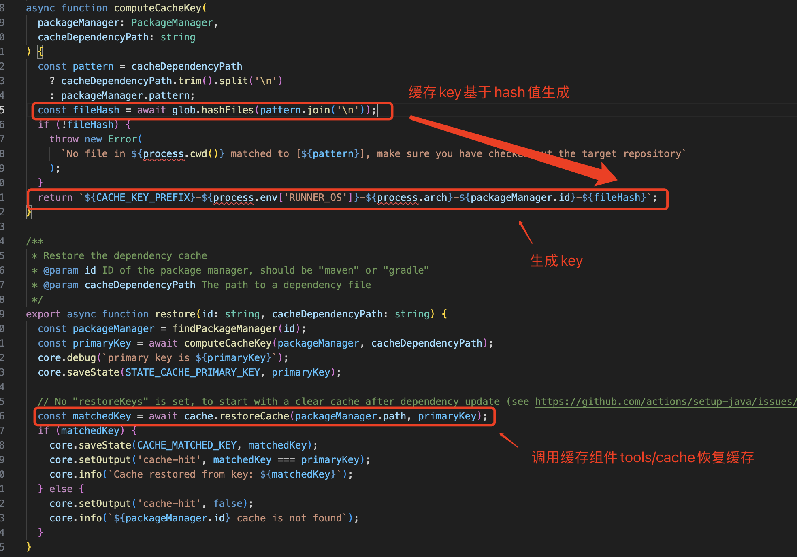
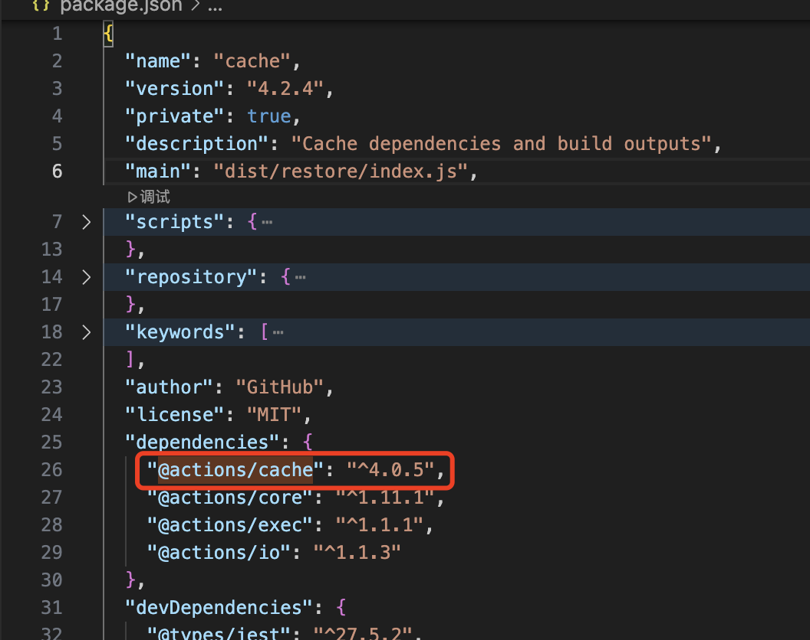

# github-actions的缓存

[setup-java]([https://](https://github.com/actions/setup-java))插件通过如下配置，可以对maven构建依赖进行缓存

``` yml
steps:
- uses: actions/checkout@v4
- uses: actions/setup-java@v4
  with:
    distribution: 'temurin'
    java-version: '21'
    cache: 'maven'
    cache-dependency-path: 'sub-project/pom.xml' # optional
- name: Build with Maven
  run: mvn -B package --file pom.xml
```
在上述插件中，通过'cache'定义缓存类型，通过'cache-dependency-path'配置的依赖文件路径生成hash值，作为缓存key。

## mavan缓存的具体实现

如上，在[cache.ts]([https://](https://github.com/actions/setup-java/blob/main/src/cache.ts))文件中可见，缓存的key是基于依赖文件生成的hash值确定的。缓存的restore是由[cache]([https://](https://github.com/actions/cache))组件实现。因此：
* maven缓存依赖文件修改，则缓存全部会失效。
* 默认的缓存，不同的操作系统和架构，不能共用。
* 可通过cache-hit，判断缓存是否命中

## [action/cache]([https://](https://github.com/actions/cache)) 是如何restore、save缓存的？

### 官方actions的组合依赖


如图可见，在cache插件中，同样引用了cache插件。cache插件本身引用了自己的历史版本，以一种组合依赖的方式，增强插件的使用。通过对依赖工具的检索，如图4.0.5对应的插件并非来源于action组下，而是来自于[actions/toolkit/cache]([https://](https://github.com/actions/toolkit/tree/main/packages/cache))。

使用这种组合机制，将核心实现放在独立的代码仓中。其他开发者可以调用核心toolkit/cache来实现自己的缓存组件。当然也可以调用actions/cache直接使用已经增强的缓存组件(推荐)。

action/caches的实现很简单，基于toolkit实现了restore和save方法，此处介绍2个属性：
* restore-keys：支持缓存的模糊匹配，有时候不一定需要获取到最精确的缓存。
* lookup-only：只检查缓存，不下载，可以通过cache-hit发现是否命中。

### 在toolkit中的缓存实现
可以很直观的发现，该缓存实现是以远端缓存的方式实现，服务端暂且不表，客户端缓存主要分为restoreCache、saveCache
#### restoreCache
1. 初始化配置与校验，基于配置可以看到远端缓存使用的是Azure Blob Storage。
2. 查询缓存条目，主要提前确认缓存情况，并且获取到ABS的临时下载链接。
3. 从ABS下载缓存tar包。
4. 解压缓存到指定目录，并清理压缩包。
#### saveCache
1. 参数和配置初始化，大文件分块上传(64MB 分块 + 8 并发)
2. 创建缓存归档文件，将依赖目录整个打tar包
3. 预约缓存条目
   * 生成key和version
   * 调用服务端，告诉服务器我要存一个缓存，键是key，版本是version
   * 服务端会返回一个临时的缓存上传链接，若存在键值冲突(缓存被使用)，则会抛出异常。
4. 上传缓存文件
5. 最终确认，为保证原子性，此处会告知服务器缓存已经上传完成。并激活缓存。
6. 异常处理、tar包清理。

### 远端缓存保存的优劣点
1. 远端缓存的时效性会低于本地盘缓存、共享盘缓存。
2. 远端缓存只能并发restore，而save动作需要保证原子性，因此部分并发任务的save会被丢失
3. 远端缓存和环境解耦，不依赖客户端底层环境，例如是否挂载共享盘等。
4. 在允许的情况下，远端缓存可以跨架构共享。
5. 用户用量可控制、可观测、可收费。
6. 开发体验好，可维护性好。
