# 起因
因近年对电影感兴趣，年初又买了戴锦华老师的电影课，然而苦于电影资源寻找不易、资源下载观看麻烦、各视频网站性价比却越来越低。

同时机缘巧合下获得了某PT小站的邀请码，联通又推出一款超性价比的宽带，腾讯云服务器即将到期。没错，就这几件八杆子打不着的事情，决定好好尝试下组建家庭网络。

# 需求
1. 在线看电影、资源下载维护
2. 家庭服务器（部署博客服务、nextchat等）
3. 家庭网关（自动翻墙、广告过滤）
4. 本地私有云

# 家庭组网方案
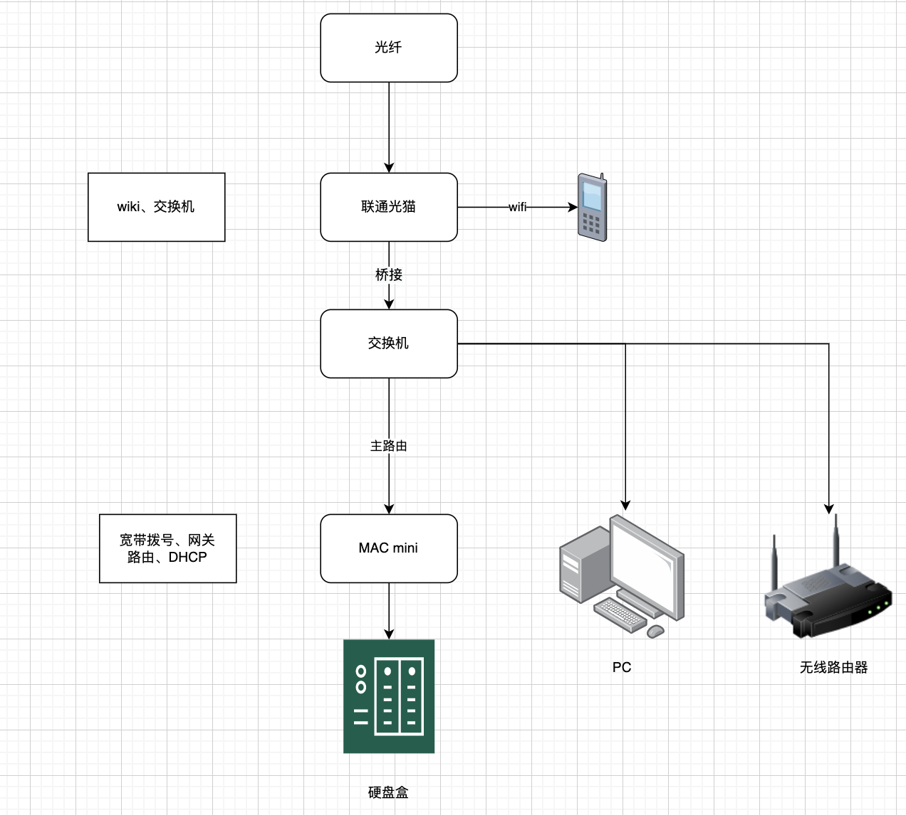
1. 光猫桥接，宽带申请公网IP
2. Mac mini作为家庭伺服器、主路由、网关（身兼数职、利弊两有）
3. PC通过交换机连接网关
4. MACmini外接硬盘盒作为NAS
5. 可利用光猫本身的wiki能力，也可以外接路由器，提高wifi吞吐量

### 为什么不使用光猫直接拨号？
经验证，虽然开了公网，但是光猫自动拨号获取的是IPV6，但是MAC手动拨号可获取IPV4。

### 缺点与隐患
MAC mini身兼数职，降低了家庭组网的复杂度，上手简单。但是主路由一旦宕机，整个网络都会瘫痪（笔者使用一段时间后，确实出现内存溢出、网络调用死循环导致）

### 可尝试的优化方案
主路由采用无线路由器，MACmini只作为旁路由使用。则当旁路由宕机，只会影响到🪜、服务器等非必要功能。且只要主路由存活，则随时可通过远程连接访问恢复。
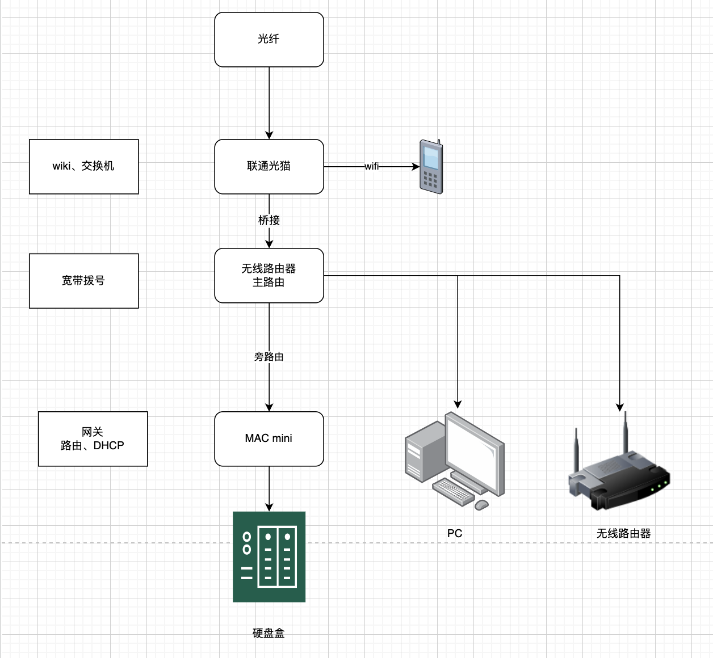

## 公网、光猫、宽带
### IP的申请
我使用的是上海联通，开通公网相对来说比较简单，直接打客服电话人工服务即可。
注意不需要说开通IPV4，直接说开通公网即可。笔者就是说了开通IPV4后，客户人员会拒绝给你开通，后续补充说开通V6即可，才给通过。

笔者使用桥接模式拨号后，可以获取到V4公网，此处的公网IP并非固定公网IP，在重新拨号后会被重新更新，后续需要配合DDNS，防止公网IP变动导致无法访问

总之，以笔者所在的上海地区，对于公网IP的申请。只要申请者态度坚决，大概率可以申请到。

### 桥接与宽带拨号
首先，改桥接需要使用到超密，直接找安装宽带的师傅获取即可，一般都可以很爽快的给，特别是宽带安装的服务阶段。

使用超密登陆联通光猫后，进入网络->宽带设置->Internet连接。选择带internet字段的连接名称，设置模式为bridge即可。
需要说明的是，此处绑定端口是指对光猫上端口的利用，即绑定后的端口的光猫可作为交换机与无线wiki使用。
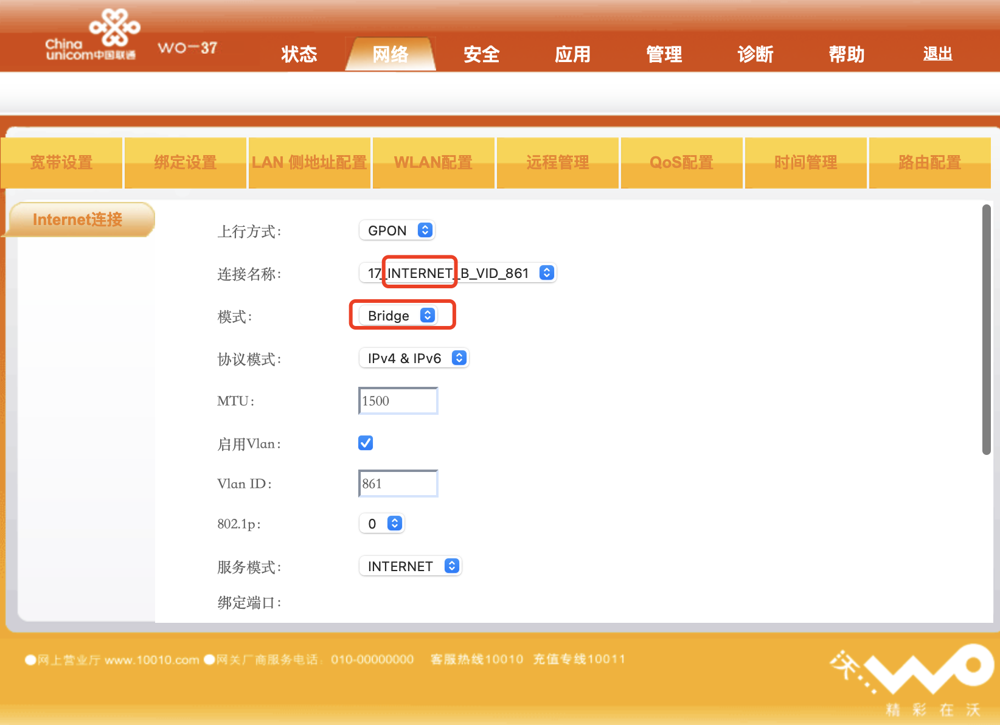
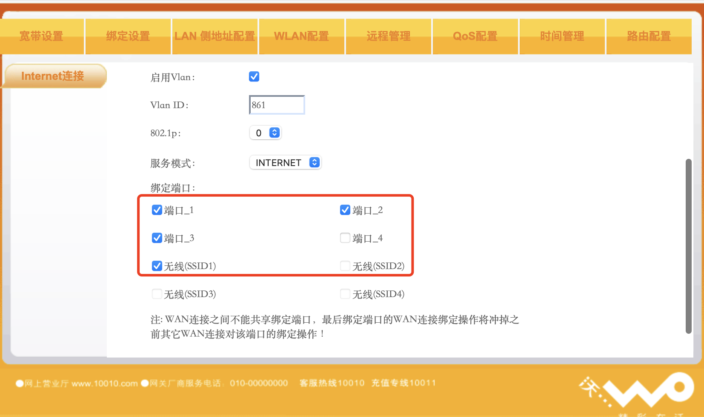
其余的参数不要修改，特别是MTU和Vlan ID。可能会导致一些无法预期的结果。

### 拨号上网
连接光猫开放的绑定段欧，使用MAC自带的PPPoE拨号上网即可。
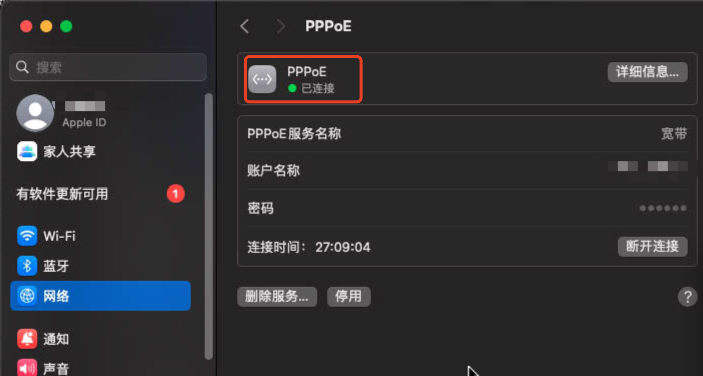
通过在线的[IP地址查询工具](https://tool.lu/ip/)，可以找到斌登陆服务，由此整个公网访问搭建完毕
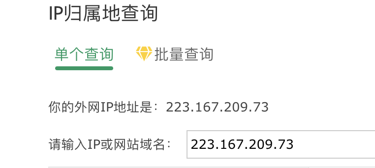
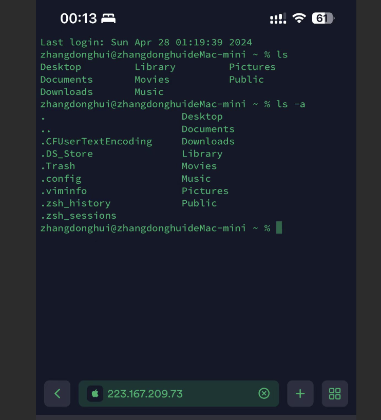

### 本地NAS服务
NAS作为网络存储服务，不但知识文件存储，还要保证高可用、可恢复、高可靠，但是作为个人级别的NAS，只要能存取、能随时访问访问，因此笔者主要为了满足以下几点诉求。
* 能满足支持4K视频的在线观看的IO吞吐量
* 较为稳定的文件存储，可接受不可恢复的文件损坏
* 代替百度云盘，在线图片、视频存储与下载
* 耗电量低、使用方便、部署方便、共享方便

#### SMB文件共享
配合MAC mini，如下图所示，使用文件共享，可通过SMB协议共享文件目录。
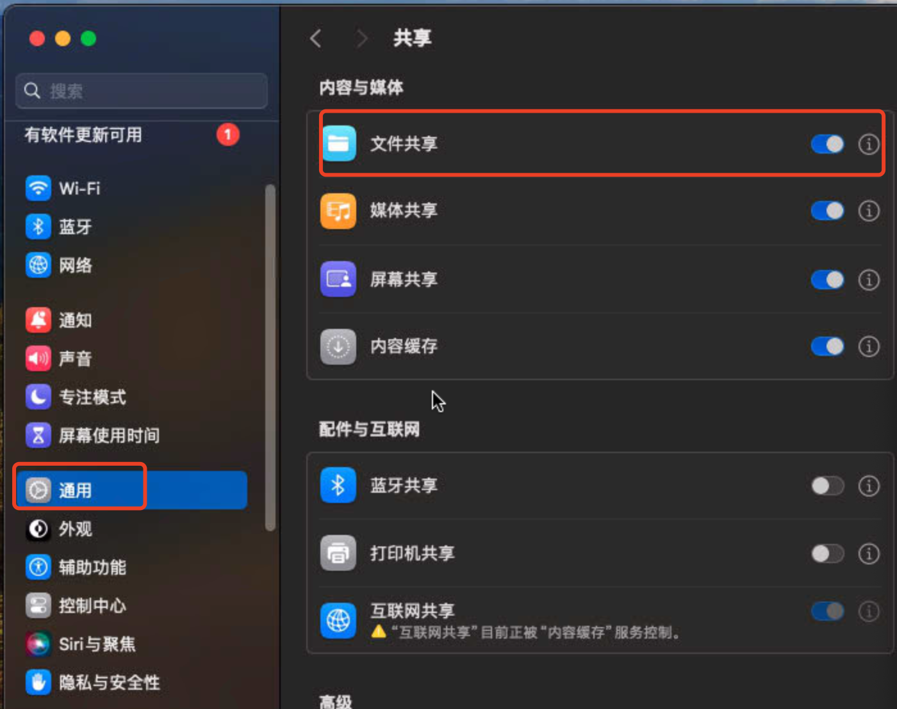
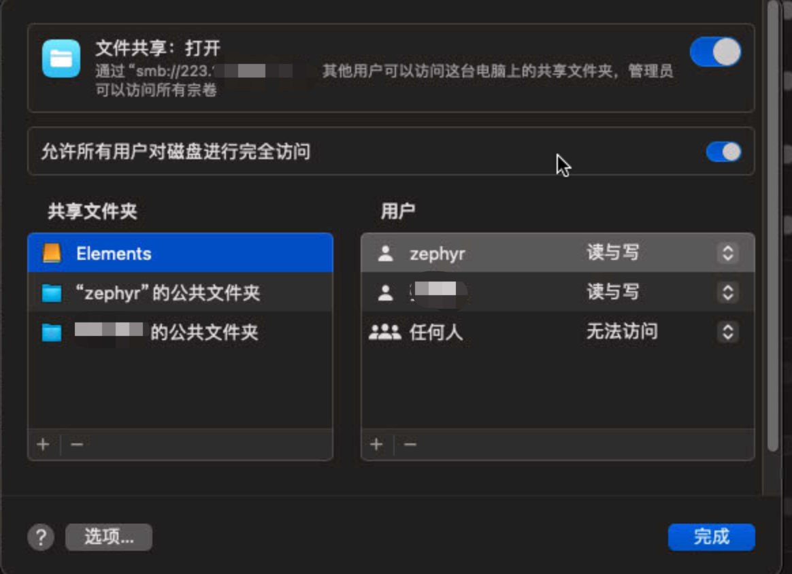
配合infuse等支持SMB的客户端与开放的公网IP，即可通过互联网连接NAS，进行文件共享。

#### ShadowSocks远程回家
大部分场景，SMB无法直接暴露到公网，一是安全原因、一是SMB相应的445端口可能会被封锁，导致网速受限，或者干脆无法访问。

1. [服务端安装(MAC)](https://github.com/shadowsocks/shadowsocks-rust)

```shell
# 安装服务端
brew install shaodowsocks-rust
# 生成密码
ssservice genkey -m "aes-256-gcm"
# 新增配置文件(ss.json)如下
{
    "server": "0.0.0.0",
    "server_port": 8388,
    "password": "OUQdsZslX6kp34zQKv/HGZ8dLmkeU/ZsPXbtVqjw/Xw=",
    "method": "aes-256-gcm",
    // ONLY FOR `sslocal`
    // Delete these lines if you are running `ssserver` or`ssmanager`
    // "local_address": "127.0.0.1",
    // "local_port": 1080

}
# 服务启动
sudo ssserver -c ss.json
```
如图所示服务启动成功
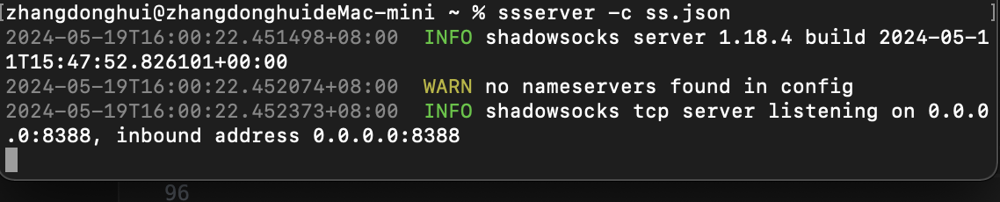

2. 客户端安装(IOS)
首先需要安装SS客户端，此处推荐shadowRocket，新增配置如图所示
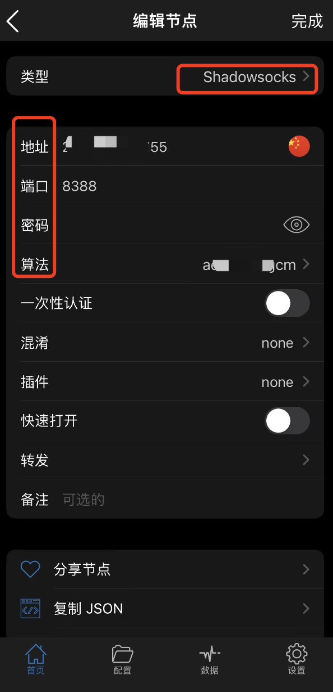
其中地址为上述步骤获取到的公网IP，当然后续配置DDNS后，可调整为域名。

#### Infuse
此处以远程上网看视频为例，推荐使用Infuse。在打开SS代理后，可通过内网IP访问家中服务，配置如下：
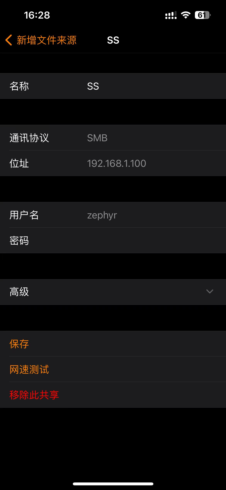
通过测速，可观察到连接速度符合出网带宽
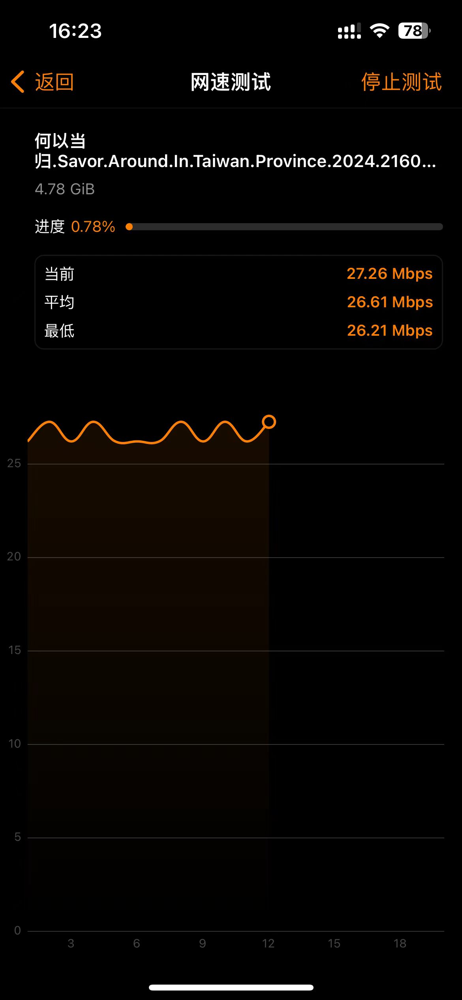
