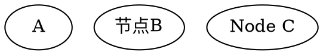
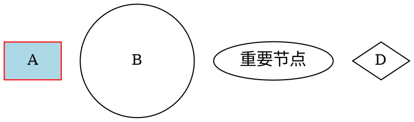
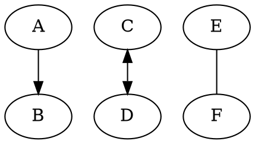
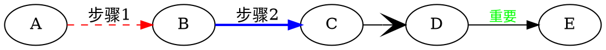
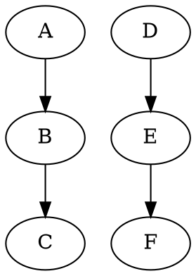
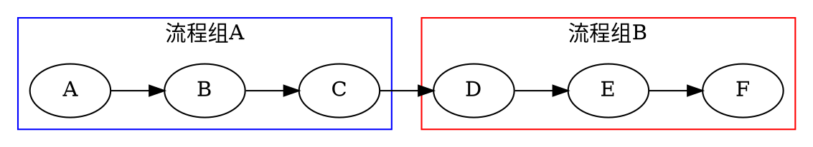
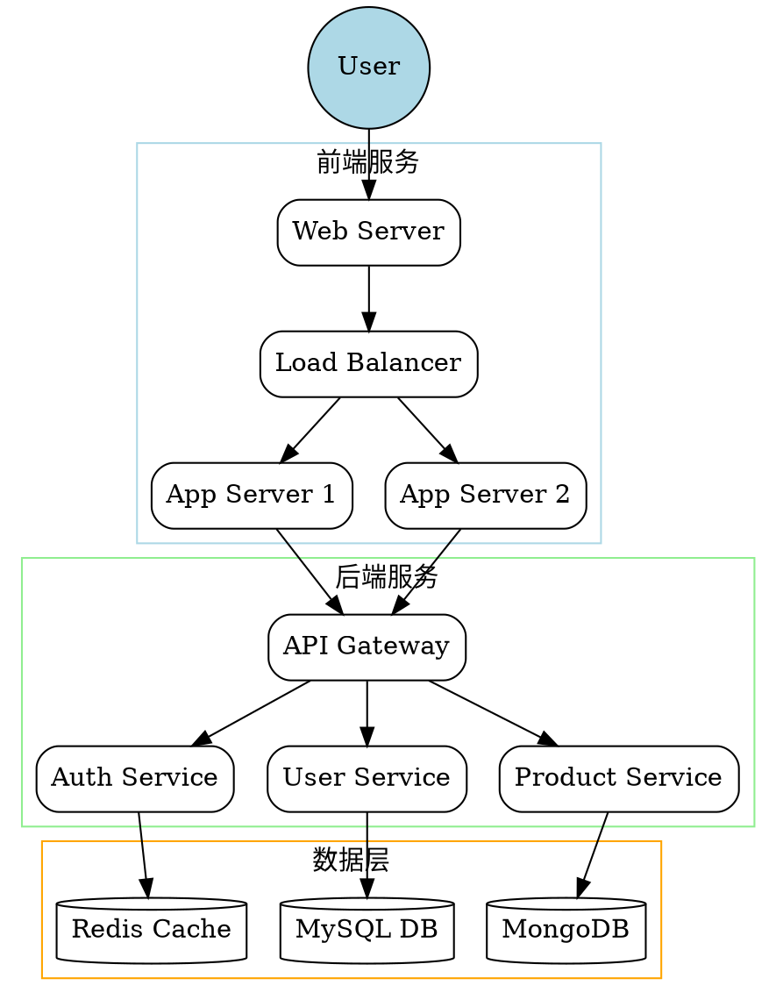
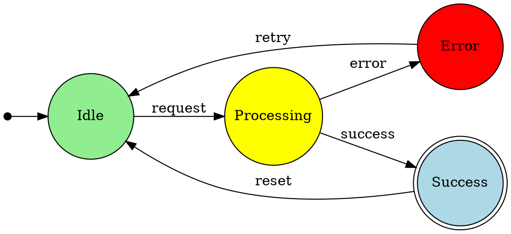

# 节点
## 基本节点

## 节点基本属性

## 常用节点形状：
* circle, box, ellipse, diamond
* triangle, plaintext, record, Mrecord
* doublecircle, doubleoctagon

# 边
## 基本边

## 边属性

# 图形布局属性
## 方向控制

## 子图

# 复杂示例

## 软件架构图

## 状态机图

