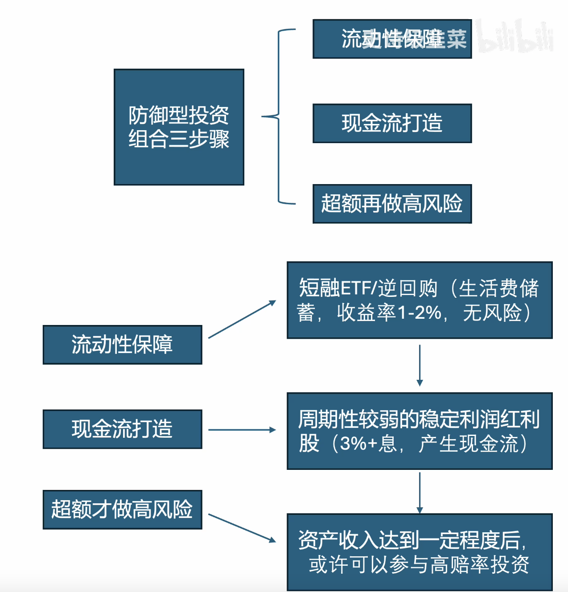
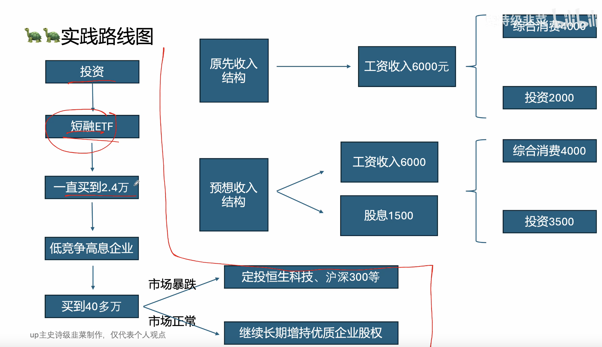
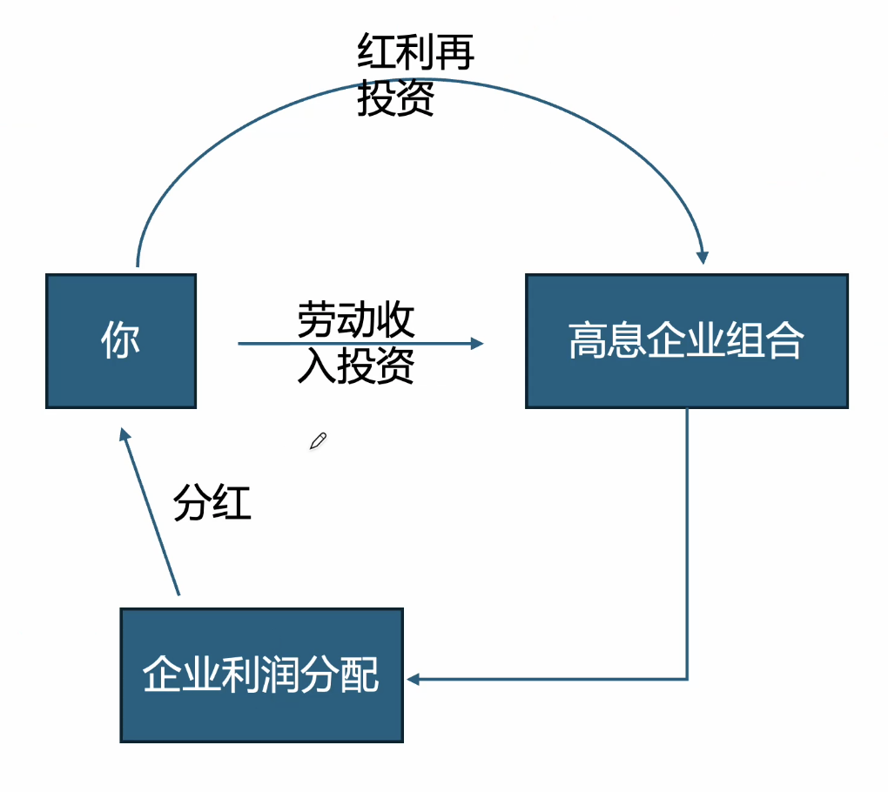

# 开篇防范论

## 目的
在保证日常流动性的前提下，逐步打造自己的股权组合，使得每年获得一定的资产性收入，当资产性收入达到一定程度后再考虑高赔率投资。

## 防御性投资组合的三个步骤
### 流动性保障
短融ETF无风险，年收益率1-2%。最少储蓄半年生活费（4000*6=2.4万）。

### 现金流再打造

周期性较弱的稳定利润红利股，3%收益率以上，用于产生现金流。长期持有收息，以覆盖30%的生活费（4000*12*0.3/0.03=48万）

可以是红利ETF、自组合的高息企业组合

### 超额再做高风险
#### 前提
完成了半年短融ETF等方式的半年以上生活费的的流动性储备，且红利组合能够产生生活费30%的替代。为了加速自身的资产增值，可以在某些特殊时刻，进行高直博率投资。

高直博率的投资，是指在不对称情况下，市场投资性价比远远大于长期的均值水平，此时进行一些高弹性的投资。

#### 核心
极致的捡漏

#### 举例
上证低于3000点，恒生跌破4000，每跌100，进行定投沪深300和恒生互联网ETF。

