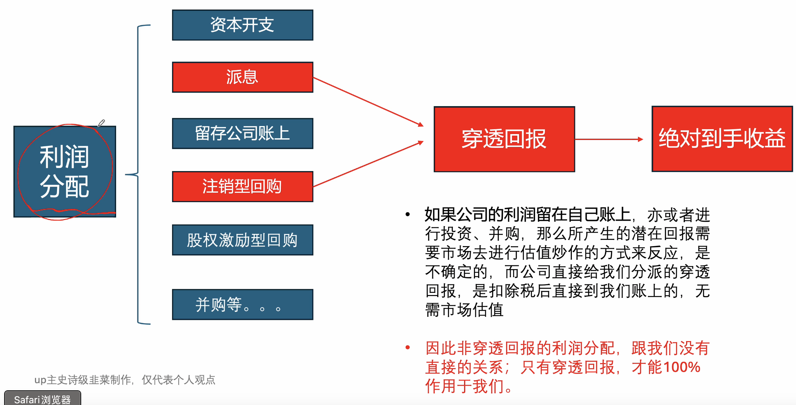
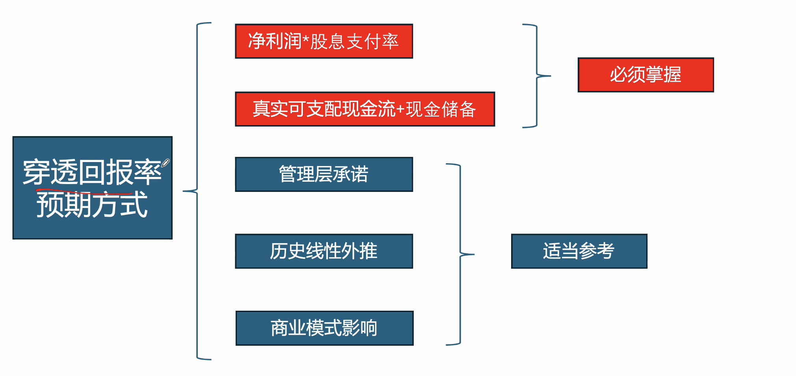

# 选股替代被动投资

* 一部分有能力或者精力的朋友，想要优化获得现金流的标的，并不满足于被动投资红利ETF。通过一系列筛选，找到一套寻觅股息穿透稳定的企业。

## 选股因子1：商业模式

商业模式是一个企业的利润稳定性、利润可支配率、是否具备提价权、是否每年进行重复资本开支等表现的根源。

商业模式是选股考虑最核心的因素，即判断这个公司是不是一个好生意。商业模式的评估是多维度、部分主观的、需要经验的，同时具备一部分客观性的综合评估。

### 商业模式：能否看懂
看懂商业模式是否适合自己的第一步，首先是能否看懂这个公司的经营和主要产品，是否能理解该公司生产的是什么产品？这个产品是什么东西？解决的什么需求？

如果看不懂，或者自己的知识水平不足以理解该公司的产品，则必须坚持不懂坚决不碰。无论多么诱惑，多么天花乱坠，只要买入，就是在投机。

举例：康放生物商业模式创新药管线（一票否决），伊利股份的牛奶（清晰可见）。

### 商业模式：重复性的资本开支
在看懂商业模式的前提下，我们关注公司是否需要持续且重复的资本开支，尤其要关注公司的利润产生是否需要大额的、重复性的资金投入。

最理想的商业模式，是在前期的重大资本开支逐渐落地后，后续利润的持续产生只需要一些低成本开支，从而使公司获得更大比例的现金流。如果重复性资本开支较低，会极大降低企业的风险，提高回报能力，反之相反。

举例：阳宅和阴宅。

### 商业模式：赚真钱还是赚假钱
所谓的赚真钱还是赚假钱，即公司是收现金还是收应收账款的。个人认为，公司产品或服务的销售，是先钱后货的模式，属于优质商业模式，该模式收入没有递延和坏账的风险。不会损失时间价值，也不会引发计提损失。

反之，如果是先货后钱，甚至长期给下游垫钱供货，属于劣质的商业模式，因为下游坏账就需要折损坏账部分的利润。同时如若现金流断裂，公司甚至需要借钱度日，增加财务费用。

在格系投资策略中，应收账款在利润表中要去除坏账，并折价50%

举例：澳门博彩行业（先钱后货） 电力公司（先货后钱）

### 商业模式：垄断还是竞争
竞争型行业的核心问题就是难以判断行业的发展态势，同时竞争型行业经常出现激烈竞争导致行业一起亏损，此处点名批评光伏，同时龟龟更倾向于国资型企业。

垄断行业不一定意味着暴利，只是通常情况下能够行业整体稳定盈利，同时现金流和利润的稳定性比较强，但往往需要阶段性承担社会责任。

### 商业模式：有无定价权
有无定价权是企业是否具备调整自己产品售价的能力，即企业能否主动改变自己产品的销售价格。

有无定价权不等于产品的售价是否变化，而主要强调的是主动性。

有定价权的企业能把成本侧的变化升高主动转移给下游消费着，从而对成本侧成本大幅上升具备一定的抵御能力；无定价权的企业容易在周期变化中发生毛利率的大幅变动，甚至亏损。

我们希望企业能拥有明显的定价权。无定价权的企业，最好选择成本侧弱周期的，有定价权的企业，可以对成本侧是顺周期性的产生一定的抵御能力。但是在能够选择的前提下，我们依然推荐成本弱周期的，消除变量。

举例：发电企业(无定价权) 双汇发展(有定价权)

### 商业模式：周期性有多强
此处的周期，是指企业的成本侧和出售的产品侧的周期性。是指企业的产品的售价或者成本的进价，是否会随着经济周期、供需关系的改变而大幅变化。

周期型产生的根源，就是产品高度一致性，导致所有人处于一种博弈论的环境。当企业生产的产品没有任务区别，每个企业都倾向于在盈利的阶段扩产，否则其他人就会扩产，直到产能过剩进行亏损，然后慢慢清退产能，直到周期回升。

因此周期性较强的，往往是生产相同的产品的行业，比如煤炭、石油、金属等。企业的产品之间没有明显的差异。

### 总结
理想型商业模式条件：
* 你能够充分理解的行业和企业
* 较低的重复性资本开支（后期只是赚多赚少的问题，不赔钱）
* 以现金为主的首款方式（不存在坏账和经常性亏损的空间）
* 具备一定的垄断性（减少不可预测的商业内卷）
* 具备定价权（可转移上游周期性）
* 本身市场周期性较弱（未来的利润和姑息与现在高度相关，可预测性强）

## 选股因子2: 穿透回报率

投资一家公司，本质上就是投资了一个从市场中源源不断赚钱的载体，而这个载体赚钱后，他不一定“忠诚”的向载体的所有者分派利润，这一些载体喜欢把利润“截流”或者“开支”。

我们关注的是到底能从这个赚钱的生意上获得多少穿透到我们身上的回报，而这个载体本身赚了多少的利润表现，我们并不关心。

比如A公司每年赚到的市值的10%，但是长期不向所有者分配。而B公司每年只赚到市值的5%，但是稳定的向所有者分配60%的部分，也就是5%*60%=3%的穿透回报率。那么我们认为B公司远远好于A公司，即使A公司市盈率是A公司的两倍。

如图所示，只有派息和注销型回购，才是穿透回报，才是绝对到手的收益

### 穿透回报率的预期方式

#### 利润和股息支付率

净利润*股息支付率 => 公司公告最低股息支付率 * 你预测的保守未来利润

股息支付率的定义：利润中用于派息的比例，大量上市公司会在投资回报计划中明确给出最低的股息支付率。如果上市公司未给出，只能采用历史经验主义推测，对于一些派息长期稳定的公司，线性外推是合理高效的。

其中最难预测是净利润，而商业模式的难易程度直接决定了预测利润的难度，普通人选择一些极度透明和简单的商业模式是判断净利润的最好的前置。

注：注销型回购也属于穿透回报，而股权激励型回购，本质上是消耗现金给管理层发股，不属于回报，甚至需要在利润中减除，并降低印象分。

**举例**

五粮液申明24-26年股息支付率不得低于70%，且最低200亿，即其姑息支付率为70%。考虑到五粮液是利润季度稳定的消费型公司，我们预计利润为前一年的80%。于是我们以五粮液静态利润的8折作为悲观估计，以承诺的70%作为股息支付率的下限。可得到悲观状态下如下：

**穿透回报率**
318.5亿利润 * 8折悲观利润 * 70%股息支付率/目前总市值4850亿 = 3.6%

**倒算目标价格**
* 318.5亿利润 * 8折悲观利润 * 70%股息支付率/假设4%姑息 = 4459亿市值
* 4459亿市值/38.82亿总股本=117元
* 因此在正常情况下，五粮液需要低于117元以下，才能有较稳定的4%股息率。

#### 现金储备

所谓真实可支配的现金流，就是看公司有多少钱可以用于派息，有些公司虽然有不少利润，但是其投资花销远大于经营得到的现金，他的股息本质上是贷款派息，这是不可靠不可持续的。

在有选择的情况下，我们应该优先选择经营得到的现金流-资本开支流出的现金-财务费用消耗的现金，即真实剔除投资开支+银行利息后赚到的现金能够覆盖派息。这种派息才是可持续的。

现金储备扣除银行贷款，尤其是短期z借款，是一种粗略的衡量公司能否稳定派息的一个保障。更加保守的计算口径，是总现金 - 流动负债。简单来说，最好情况喜爱公司流动现金能满足派息，可接受的情况是公司轻微负债或者无负债。极端情况下，公司债务规模是利润的10倍，这种公司应该敬而远之。

* 我们可以观察到，华润电力的投资消耗的现金远大于经营所得现金，靠融资几百亿维持
* 五粮液的经营性现金流入远大于投资开支消耗的现金，即使在几十亿派息的情况下，现金储备仍然在增加。因此五粮液是分派自己赚到的钱，是可持续的，而华润是在不断透支。

* 恒大和长实都属于高股息的房地产，存在大量的收息投资者购买。但是恒大的现金在1500亿左右，而他一年内的到期的短期借款已经突破3000亿。而短期负债接近1.5亿，是利润的10倍！而长实拥有600亿现金，短期借款仅68-200亿，甚至能够直接还整个流动负债。

#### 管理层承诺

管理层若有有明确具体的分红金额+回购金额，你可能可以捡漏了！注意！这种承诺并不完全可信！！

#### 历史线性外推
对于长期(5到10年)不变的派息金额或者股息支付率，可以采用线性外推的方式参考。这也意味着这些公司有稳定的派息金额或者派现率。

#### 商业模式
有些行业非常卷，需要大量的研发、建造维持自己的竞争优势，企业无法不花钱；有些企业属于部分垄断企业，因为不允许无法往外发展，钱没地方花，只能分红。前者类似光伏，只能不断内卷；后者类似高速公路，除了到期大修维持路权，基本无法开扩，只能分红。

#### 理想中的穿透回报率条件
* 高度可计算的回报率，首先搜查有无公开文件规定了最低的股息支付率或者管理层直接公开承诺的金额
* 如没有，可以根据有无历史稳定的派息规律进行线性外推
* 如果还没有，那么回报的结果就是高度不确定的，我们只能按照商业模式结合历史数据悲观判断
* 同时我们要求安全的现金流和现金储备
* 穿透回报率的诉求，至少为3%，最好5%以上，且要同时满足大于货币无风险利率1%

